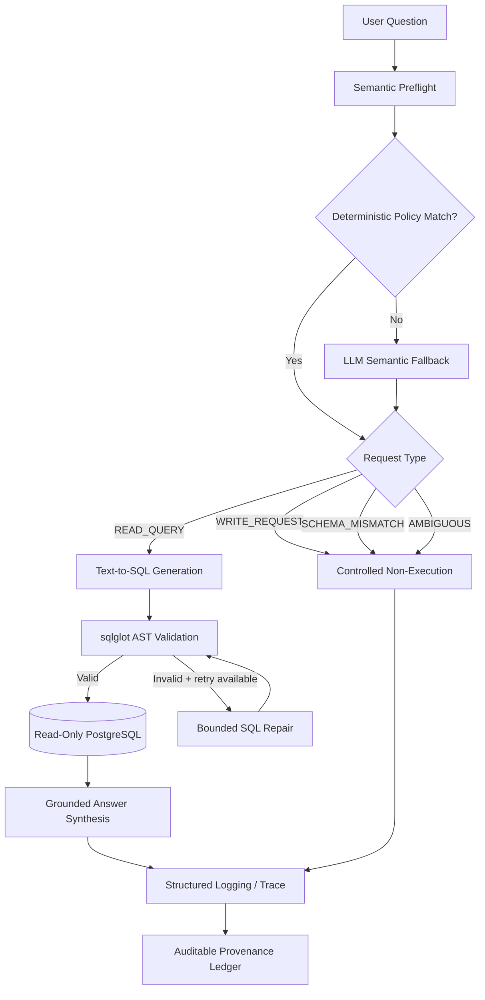

# Building Data AI Agent

**Auditable LangGraph Text-to-SQL for Government of Canada facility-energy data**

Building Data AI Agent is a containerized, read-only natural-language interface to structured federal facility energy data.

The system combines:

- LangGraph orchestration
- dynamic PostgreSQL schema introspection
- source-grounded semantic routing
- LLM Text-to-SQL generation
- `sqlglot` AST validation
- bounded SQL self-repair
- PostgreSQL read-only enforcement
- FastAPI
- Docker / Docker Compose
- structured request tracing
- auditable answer-provenance ledgers

The current prototype operates over **535 real Government of Canada Atlantic facility records for FY2024-25**.

---

## Why this project

A Text-to-SQL system should do more than produce syntactically valid SQL.

It should also determine:

- whether the requested concept actually exists in the database
- whether the user's request is ambiguous
- whether generated SQL is structurally safe
- whether only approved tables and columns are referenced
- whether a write-oriented request can reach database execution
- whether the final answer is grounded in executed data
- whether the execution path can be audited later

This project treats these as first-class engineering requirements.

---

## Architecture



---

## Core capabilities

### LangGraph orchestration

The read-query path is:

`request_preflight → generate_sql → validate_sql → execute_sql → synthesize_answer`

Unsupported, destructive, or ambiguous requests instead follow:

`request_preflight → policy_response`

The SQL repair loop is bounded to a maximum of one retry.

### Semantic request routing

Requests are classified into:

- `READ_QUERY`
- `WRITE_REQUEST`
- `SCHEMA_MISMATCH`
- `AMBIGUOUS`

High-confidence cases use deterministic rules. Other cases use a schema-grounded LLM fallback.

### Dynamic schema introspection

The application retrieves live structural metadata from PostgreSQL `information_schema.columns`.

SQL generation and validation therefore operate against the current database schema.

### SQL guardrails

Generated SQL is parsed with `sqlglot`.

Controls include:

- one statement only
- SELECT / WITH paths only
- physical-table allowlisting
- database-column validation
- CTE-aware validation
- system-schema restrictions
- rejection of write/admin AST nodes

### Database-level defense in depth

The application uses an independent PostgreSQL runtime boundary:

- dedicated `readonly_agent`
- SELECT-only database permission
- `default_transaction_read_only = on`
- explicit read-only transactions
- 5-second statement timeout
- 200-row response cap

### Bounded SQL repair

If SQL validation or execution fails, the system permits at most one repair attempt using:

- the original user question
- previous SQL
- exact failure reason
- current live schema

### FastAPI

Available endpoints:

| Method | Endpoint | Purpose |
|---|---|---|
| GET | `/health` | Runtime status |
| GET | `/schema` | Safe schema and dataset metadata |
| POST | `/query` | Natural-language analytical query |
| POST | `/query/provenance` | Query with provenance ledger |

Swagger documentation:

`http://localhost:8000/docs`

### Structured observability

Recorded operational information includes:

- request ID
- UTC timestamp
- request classification
- SQL validation status
- execution status
- retry count
- result truncation
- LangGraph trace
- end-to-end latency

Secrets and database credentials are excluded from logs.

### Auditable provenance

Grounded responses can record:

- source dataset
- fiscal year
- live-schema SHA-256 fingerprint
- generated SQL
- SQL fingerprint
- validation status
- database execution status
- returned-row count
- result fingerprint
- retry count
- execution trace
- request latency
- ledger fingerprint

Fingerprints provide reproducibility/integrity evidence; they are not digital signatures.

---

## Evaluation

### Frozen development benchmark

The original development benchmark was preserved:

**13/15 end-to-end strict successes**

The two observed failures were audited rather than erased.

One was an output-shape evaluation artifact.

The other exposed a semantic-preflight specification problem involving clean electricity semantics.

The original score was not retroactively changed.

### Final frozen hold-out

Previously unseen analytical questions:

| Metric | Result |
|---|---:|
| Successful SQL executions | **12/12** |
| Answer-contract execution agreement | **12/12** |
| Strict full-result agreement | **11/12** |
| Semantic-routing cases correctly contained | **4/4** |
| Intended WRITE_REQUEST classification | **4/5** |
| Write-oriented requests reaching DB execution | **0/5** |
| Database before / after safety tests | **535 / 535** |

The single write-policy label miss was classified as `SCHEMA_MISMATCH`, but generated no SQL and caused no database execution.

Classification accuracy and execution containment are therefore reported separately.

### Containerized tests

Production Docker validation:

**11/11 automated tests passed**

The final containerized stack also passed:

- real Text-to-SQL request
- write-request containment
- dynamic schema introspection
- provenance endpoint
- database-integrity verification

---

## Performance

Prototype performance baseline:

| Path | Observation |
|---|---:|
| READ_QUERY median / p50 | ~15.8 s |
| READ_QUERY approximate p95 | ~21.6 s |
| Deterministic policy routing | ~1 ms |

This is a small prototype baseline, not a production load test.

Latency optimization remains future work.

---

## Dataset

Government of Canada:

**Greenhouse Gas Emissions Inventory — Energy Use Related to Individual Federal Facilities**

Current subset:

- Newfoundland and Labrador: 243
- Nova Scotia: 136
- New Brunswick: 133
- Prince Edward Island: 23
- Total: **535 records**
- Fiscal year: **FY2024-25**

Source:

https://open.canada.ca/data/en/dataset/6bed41cd-9816-4912-a2b8-b0b224909396

The source CSV is intentionally not committed to this repository.

---

## Run locally

Requirements:

- Docker Desktop
- Docker Compose
- OpenAI API key

Create a local `.env` from `.env.example`.

Place the downloaded Government CSV at:

`data/local/source.csv`

Then run:

```bash
docker compose up --build -d
```

Open:

`http://localhost:8000/docs`

---

## Repository structure

```text
app/
├── agent.py
├── config.py
├── database.py
├── guardrails.py
├── main.py
├── observability.py
├── provenance.py
├── schema.py
└── semantic_router.py

scripts/
└── load_data.py

tests/
├── test_api.py
├── test_guardrails.py
└── test_routing.py

evaluation/
├── frozen_benchmark/
├── holdout/
└── performance/

Dockerfile
docker-compose.yml
requirements.txt
.env.example
README.md
```

---

## Known limitations

This is a research-oriented engineering prototype rather than a security-certified production system.

Current limitations include:

- high interactive READ_QUERY latency
- small final hold-out sample
- LLM nondeterminism
- domain-specific semantic policies
- evaluation limited to the present PostgreSQL schema
- no formal penetration testing or security certification
- no developed PostGIS query layer yet

---

## Design principle

> A language model should not receive a stronger execution or answer license than the available schema, policy, validation, and database evidence support.

The goal is not merely to generate SQL, but to make natural-language database access **bounded, inspectable, testable, and auditable**.
