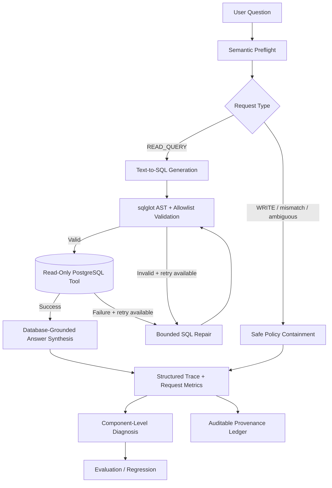

# Building Data AI Agent

**Production-oriented, bounded LangGraph Text-to-SQL agent with read-only tool execution, SQL safety guardrails, structured tracing, failure diagnosis, and auditable provenance.**

Building Data AI Agent is a containerized natural-language interface to structured Government of Canada facility-energy data. The project treats the LLM as **one component inside a controlled execution harness** rather than as a standalone prompt wrapper.

The current prototype operates over **535 real Government of Canada Atlantic facility records for FY2024-25**.

## Why this is an agent system

A prompt wrapper mainly performs:

`prompt → model → answer`

This project performs:

`question → semantic preflight → live schema context → SQL generation → AST validation → read-only database tool → bounded repair → grounded synthesis → trace → diagnosis → evaluation`

The harness controls what the model may do, what tools it may reach, when a retry is licensed, when execution must stop, what gets logged, and how failures are classified.

## Architecture



## Production engineering controls

### Agent harness and routing

LangGraph orchestrates explicit execution states instead of relying on an unconstrained agent loop. Requests are classified as:

- `READ_QUERY`
- `WRITE_REQUEST`
- `SCHEMA_MISMATCH`
- `AMBIGUOUS`

Unsupported or destructive requests are contained before database execution.

### Live schema grounding

The agent reads current PostgreSQL schema metadata from `information_schema.columns`. SQL generation and validation therefore operate against the live database structure rather than a manually copied schema description.

### SQL safety guardrails

Generated SQL is parsed with `sqlglot`. Controls include:

- one statement only
- SELECT / WITH execution paths only
- physical-table allowlists
- live column validation
- CTE-aware validation
- system-schema restrictions
- rejection of write/admin AST nodes

### Database-level defense in depth

Safety does not depend on the LLM obeying a prompt. The database boundary independently enforces:

- dedicated `readonly_agent` role
- SELECT-only permissions
- `default_transaction_read_only = on`
- explicit read-only transactions
- 5-second statement timeout
- 200-row response cap

### Bounded repair, not an open loop

Validation or execution failure may trigger **at most one SQL repair attempt**. The repair receives the original question, previous SQL, exact failure reason, and live schema context.

There is no indefinite `think → act → observe` loop.

### Structured observability

Each observed run records operational fields such as:

- request ID
- UTC timestamp
- request classification
- SQL validation status
- execution status
- retry count
- result truncation
- LangGraph trace
- end-to-end latency

Credentials and database secrets are excluded from logs.

### Component-level failure diagnosis — v0.2

The v2 engineering layer classifies observable run outcomes into categories such as:

- `SUCCESS`
- `SAFE_POLICY_CONTAINMENT`
- `SQL_VALIDATION_BLOCK`
- `TOOL_EXECUTION_FAILURE`
- `REPAIR_EXHAUSTED`
- `ROUTING_FAILURE`
- `LATENCY_BUDGET_EXCEEDED`

A write request that is safely prevented from reaching database execution is **not mislabeled as a failure**.

API responses can expose:

- `outcome_category`
- `failure_category`
- `recommended_fix`
- `trace_steps`

This turns traces into actionable engineering signals rather than raw logs only.

### Auditable provenance

The provenance path can record:

- source dataset and fiscal year
- live-schema SHA-256 fingerprint
- generated SQL and SQL fingerprint
- validation and execution status
- returned-row count
- result fingerprint
- retry count
- execution trace
- request latency
- ledger fingerprint

Fingerprints provide integrity/reproducibility evidence; they are not digital signatures.

## Portfolio notebook

A compact, secret-safe notebook explains the production engineering contract, explicit stop policies, diagnosis taxonomy, operational metrics, and layered evaluation:

[`notebooks/Building_Data_AI_Agent_Production_v2.ipynb`](notebooks/Building_Data_AI_Agent_Production_v2.ipynb)

## Evaluation

### Frozen development benchmark

The original development benchmark was preserved rather than retroactively cleaned:

**13/15 end-to-end strict successes**

The two failures were audited. One was an output-shape evaluation artifact; the other exposed a semantic-preflight specification problem.

### Final unseen hold-out

| Metric | Result |
|---|---:|
| Successful SQL executions | **12/12** |
| Answer-contract execution agreement | **12/12** |
| Strict full-result agreement | **11/12** |
| Semantic-routing cases correctly contained | **4/4** |
| Intended WRITE_REQUEST classification | **4/5** |
| Write-oriented requests reaching DB execution | **0/5** |
| Database before / after safety tests | **535 / 535** |

The single write-policy label miss was classified as `SCHEMA_MISMATCH`, but generated no SQL and caused no database execution. Classification accuracy and execution containment are therefore reported separately.

### Containerized regression suite

**11/11 automated tests passed** on the pre-v2 containerized regression suite.

The v2 branch adds dedicated unit tests for diagnosis and operational aggregation. These new tests are intentionally kept separate from the previously reported 11/11 figure until the updated stack is re-run end to end.

## Performance

Prototype baseline:

| Path | Observation |
|---|---:|
| READ_QUERY median / p50 | ~15.8 s |
| READ_QUERY approximate p95 | ~21.6 s |
| Deterministic policy routing | ~1 ms |

This is a prototype baseline, not a production load test. Latency remains an explicit optimization target and is now represented in the diagnostic taxonomy.

## API

| Method | Endpoint | Purpose |
|---|---|---|
| GET | `/health` | Runtime and control settings |
| GET | `/schema` | Safe schema and dataset metadata |
| POST | `/query` | Natural-language analytical query + diagnostic outcome |
| POST | `/query/provenance` | Query with provenance ledger |

Swagger UI: `http://localhost:8000/docs`

## Repository structure

```text
app/
├── agent.py              # LangGraph execution harness
├── config.py
├── database.py           # read-only tool boundary
├── diagnostics.py        # v2 outcome/failure classification + metrics
├── guardrails.py         # sqlglot AST and allowlist checks
├── main.py               # FastAPI surface
├── observability.py      # request IDs, traces, latency, diagnosis
├── provenance.py
├── schema.py             # live schema introspection
└── semantic_router.py

notebooks/
└── Building_Data_AI_Agent_Production_v2.ipynb

tests/
├── test_api.py
├── test_diagnostics.py
├── test_guardrails.py
└── test_routing.py

evaluation/
├── frozen_benchmark/
├── holdout/
└── performance/
```

## Dataset

Government of Canada — **Greenhouse Gas Emissions Inventory: Energy Use Related to Individual Federal Facilities**

Current Atlantic subset:

- Newfoundland and Labrador: 243
- Nova Scotia: 136
- New Brunswick: 133
- Prince Edward Island: 23
- Total: **535 records**
- Fiscal year: **FY2024-25**

Source: https://open.canada.ca/data/en/dataset/6bed41cd-9816-4912-a2b8-b0b224909396

The source CSV is intentionally not committed.

## Run locally

Requirements:

- Docker Desktop / Docker Compose
- OpenAI API key
- downloaded source CSV

Create a local `.env` from `.env.example`, place the CSV at `data/local/source.csv`, then run:

```bash
docker compose up --build -d
```

Open `http://localhost:8000/docs`.

## Known limitations

This remains a research-oriented engineering prototype, not a security-certified production service. Current limitations include:

- high interactive READ_QUERY latency
- small final hold-out sample
- LLM nondeterminism
- domain-specific semantic policies
- no persistent production metrics backend/dashboard yet
- no formal penetration testing or security certification
- no developed PostGIS query layer

## Design principle

> A language model should not receive a stronger execution or answer license than the available schema, policy, validation, and database evidence support.

The goal is not merely to generate SQL. It is to make natural-language database access **bounded, inspectable, diagnosable, testable, and auditable**.
