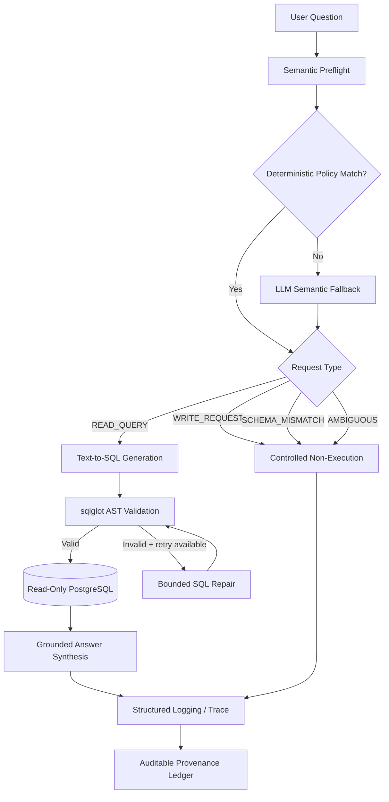
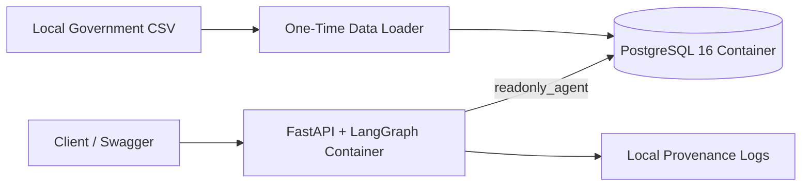

# Architecture

## System overview

Building Data AI Agent is a read-only natural-language interface
over structured Government of Canada facility-energy data.

The production stack combines:

- FastAPI
- LangGraph
- OpenAI API
- PostgreSQL
- psycopg
- sqlglot
- Docker / Docker Compose
- structured JSON logging
- auditable provenance ledgers

---

## Request lifecycle



---

## LangGraph execution paths

### Normal analytical path

```text
request_preflight
    ↓
generate_sql
    ↓
validate_sql
    ↓
execute_sql
    ↓
synthesize_answer
```

### Bounded repair path

```text
request_preflight
    ↓
generate_sql
    ↓
validate_sql
    ↓
repair_sql_retry_1
    ↓
validate_sql
    ↓
execute_sql
    ↓
synthesize_answer
```

The repair loop permits at most one retry.

### Controlled non-execution

```text
request_preflight
    ↓
policy_response
```

Used for:

- WRITE_REQUEST
- SCHEMA_MISMATCH
- AMBIGUOUS

---

## Defense-in-depth boundaries

### 1. Semantic boundary

The preflight layer determines whether a request is:

- answerable from the current schema
- ambiguous
- unsupported
- write-oriented

Selected high-confidence cases use deterministic policies.
Unresolved cases use an LLM fallback grounded in live schema
and source-column semantics.

### 2. SQL structural boundary

Generated SQL is parsed with `sqlglot`.

Validation includes:

- one-statement enforcement
- SELECT / WITH read paths only
- physical-table allowlisting
- column validation
- CTE-aware validation
- system-schema restrictions
- rejection of write/admin AST nodes

### 3. Database boundary

The application connects using a dedicated PostgreSQL
`readonly_agent` role.

Independent database controls include:

- SELECT-only permissions
- `default_transaction_read_only = on`
- explicit `SET TRANSACTION READ ONLY`

The database role remains an independent safety boundary even
if application-level validation is imperfect.

### 4. Execution-resource boundary

Queries are bounded using:

- 5-second statement timeout
- maximum 200 returned rows
- maximum one SQL repair attempt

### 5. Evidence boundary

Final analytical answers are synthesized from executed
PostgreSQL results instead of unsupported model knowledge.

### 6. Audit boundary

The provenance layer can record:

- request ID
- request classification
- generated SQL
- SQL validation status
- execution status
- returned-row count
- retry count
- LangGraph path
- request latency
- schema fingerprint
- SQL fingerprint
- result fingerprint
- ledger fingerprint

---

## Container architecture



The runtime application does not use PostgreSQL administrator
credentials.

The local `.env`, source CSV, and runtime provenance logs are
excluded from version control.
